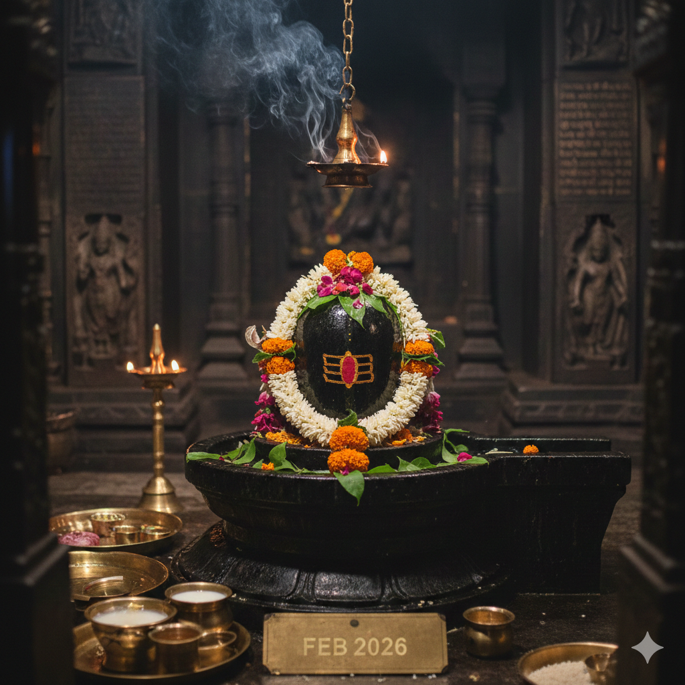

<!DOCTYPE html>
<html lang="en">
<head>
    <meta charset="UTF-8">
    <meta name="viewport" content="width=device-width, initial-scale=1.0">
    <title>Mahashivratri Virtual Puja</title>
    
</head>
<body>

    <h1>Om Namah Shivaya</h1>
    
Mahashivratri Virtual Puja

    

        

        
    

    

        <button class="puja-btn" onclick="pour('water')">Offer Water</button>
        <button class="puja-btn" onclick="pour('milk')">Offer Milk</button>
        <button class="puja-btn" onclick="offerFlowers()">Offer Flowers</button>
    

    
</body>
</html>
